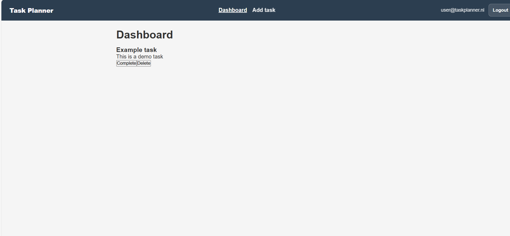

Task Planner

Task Planner is a React application that allows users to manage their tasks in an organized and efficient way.

Users can register, log in, create tasks, view them on the dashboard, search tasks, update tasks, and delete tasks.

The application communicates with the Novi Backend API and uses JWT authentication for protected routes.

Features

User registration
User login with JWT authentication
Protected dashboard route
Create new tasks
View all tasks
Search tasks
View task details
Update tasks
Delete tasks
Loading and error handling for asynchronous requests

Technologies Used

React
React Router
JavaScript (ES6)
CSS Modules
Vite
Novi Backend API

Installation Guide

1. Clone the repository

git clone https://github.com/farwara/Task-Planner.git

2. Navigate into the project folder

cd Task-Planner

3. Install dependencies

npm install

4. Configure the API

Upload the file task-planner-config.json to the Novi backend configuration page.

After uploading the configuration, you will receive a Project ID.

Create a .env file in the root of the project and add:

VITE_API_URL=https://novi-backend-api-xxxxx.ondigitalocean.app
VITE_PROJECT_ID=YOUR_PROJECT_ID

5. Start the development server

npm run dev

The application will run at:

👉 http://localhost:5173

Available Scripts

Start development server

npm run dev

Build production version

npm run build

Preview production build

npm run preview

Application structure

src

├── api

│   └── api.js

│

├── components

│   ├── common

│   │   ├── Button.jsx

│   │   ├── ErrorMessage.jsx

│   │   ├── Loader.jsx

│   │   └── TaskCard.jsx

│

├── context

│   └── AuthContext.jsx

│

├── pages

│   ├── AddTask.jsx

│   ├── Dashboard.jsx

│   ├── Login.jsx

│   ├── Register.jsx

│   └── TaskDetail.jsx

│

├── routes

│   └── PrivateRoute.jsx

│

├── styles

│   └── global.css

│

├── App.jsx

└── main.jsx

Authentication

Authentication is implemented using JWT tokens.

After logging in successfully:

The backend returns a token
The token is stored in localStorage
The token is included in API requests via the Authorization header

Example

Authorization: Bearer TOKEN

Protected routes are handled using the PrivateRoute component.

API Communication

All API requests are handled through the apiFetch function located in:

src/api/api.js

This wrapper ensures:

Correct API base URL is used
Project ID header is included
Authorization token is included
Errors are handled properly

Example request:

await apiFetch("/api/tasks", {
method: "POST",
body: JSON.stringify({
title,
description,
completed: false,
}),
});

Asynchronous Handling

The application uses asynchronous functions to communicate with the backend.

Loading states are displayed while fetching data
Errors are handled using try/catch
Requests can be cancelled using AbortController

Example:

const controller = new AbortController();

useEffect(() => {
loadTasks(controller.signal);

return () => controller.abort();
}, []);

Reusable Components

The application uses reusable components to keep the code modular and maintainable.

Examples:

TaskCard
Button
Loader
ErrorMessage

These components are reused across multiple pages to ensure consistency.

Screenshots

## Dashboard 

Example:

- Login page
  ./screenshots/login.png

- Dashboard page
./screenshots/Dashboardoverview.png
- Add task page
./screenshots/add-task.png

--------------------------------------------------

Limitations

- No pagination for large task lists
- No user profile management
- No task deadlines or priorities
- Limited error handling feedback

Future Improvements

- Add task deadlines and priority levels
- Implement pagination for better performance
- Improve UI/UX design
- Add user profile and settings page

Author

Farwa Rafique

 